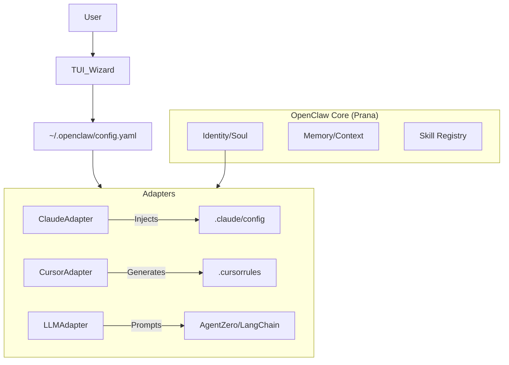

# PAI (Personal AI Infrastructure) Analysis & Summary

## Overview
PAI is an open-source "agentic infrastructure" designed to layer on top of AI coding assistants like Claude Code. It transforms a transient chat session into a persistent, context-aware "system" that evolves with the user.

## Core Philosophy
- **"Hand in Glove"**: PAI does not replace the human or the AI model; it acts as the connecting tissue (scaffolding) that makes them work better together.
- **System > Model**: A good architecture with a weaker model beats a bad architecture with a strong model.
- **UNIX Philosophy**: Composable tools, CLI-first.

## Key Capabilities (The "Value Add")

### 1. Persistence & Memory
Unlike standard Claude Code sessions which are ephemeral, PAI introduces:
- **History System**: Automatically captures decisions, research, and learnings into a structured format (Markdown/JSON).
- **Core Memory**: Maintains files like `USER.md` (preferences), `SOUL.md` (mission), and `MEMORY.md` (project context) that are injected into every session.

### 2. Event-Driven Automation (Hooks)
PAI implements a hook system (`pai-hook-system`) that triggers actions at key lifecycle events:
- **On Session Start**: Loads context, checks todos, summarizes recent activity.
- **On Tool Use**: Can intercept or log tool usage.
- **On Exit**: Auto-commits changes, updates work logs.

### 3. Modular Skills ("Packs")
Capabilities are distributed as installable "Packs" containing:
- **Code**: The actual functionality (Python/Bash scripts).
- **Prompts**: Instructions for the AI on how to use the tool.
- **Tests**: Verification protocols.
- **Docs**: Usage guides.

### 4. Interactive Onboarding
A TUI (Text User Interface) wizard guides the user through setup, ensuring the environment is correctly configured without manual config file editing.

## Architecture for "OpenClaw" (Agnostic Implementation)
To build a similar system that is platform-agnostic (OpenClaw, AgentZero, etc.), we abstract the "Integration Layer":

This structure allows "Prana" (the flow of knowledge/context) to be defined once in OpenClaw and flowed into *any* downstream agent.
