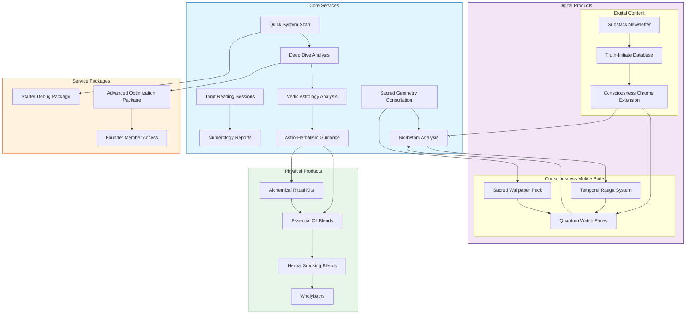

# Product Relationship Map

This map visualizes the complete product ecosystem and integration points across all categories.

## Core Categories
1. Core Services
   - Diagnostic and analysis services
   - Divination techniques
   - Pattern recognition protocols

2. Digital Products
   - Consciousness Mobile Suite
   - Digital Content Distribution
   - Integration Tools

3. Physical Products
   - Field Enhancement Tools
   - Pattern Optimization Products
   - Integration Materials

4. Service Packages
   - Entry Level Integration
   - Advanced Implementation
   - Complete System Access

## Integration Map

## Integration Notes
- Core Services provide foundation for all other products
- Digital Products offer real-time implementation support
- Physical Products support field maintenance and optimization
- Service Packages create structured implementation pathways

## Usage Guidelines
- Reference for product recommendations
- Integration protocol development
- Package design optimization
- Cross-selling opportunities

## Related Documentation
- See [[ServiceArchitecture]] for service details
- See [[ProductCatalog]] for complete listings
- See [[IntegrationProtocols]] for implementation guides